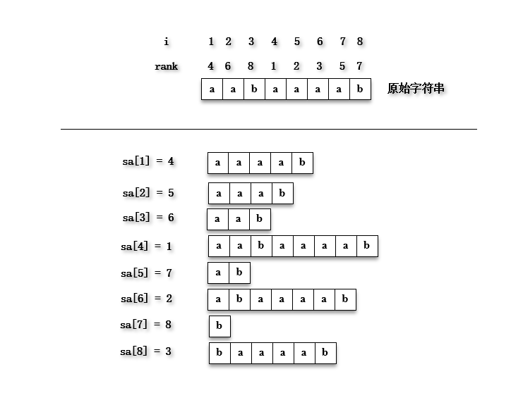

## 后缀数组讲解
> 作者: 张今天
>
> 日期: 2019-8-24
>

----

**注意的问题:**
- 后缀数组和名次数组是什么关系?
- 基数排序是怎么实现的?
- 为何要在原始字符串后面添加一个比原始字符串中所有字符都小的一个特殊字符?
- 什么是第一关键字,什么是第二关键字?
- 对第一个关键字进行基数排序后,怎么利用已知的sa数组得到第二个关键字的顺序?
- 又怎么同时对第一、第二关键字进行排序的?
- 得到第一、第二个关键字的顺序后,又怎么对比是否属于并列的顺序,即是否有相同的顺序?
- 怎么利用已知的后缀数组sa求最长公共前缀字串的?

### 1 基本定义
 
**原始字符串:** S

**后缀:** 从S中的i位置到S的末尾的特殊子串,使用Suffix(i)表示.

**后缀数组:** 后缀数组sa是一个一维的数组,是一个将S的n个后缀从小到大按字典序进行排序后的后缀开头的位置一次放入sa中.

**名次数组:** 名次数组rank也是一个一维数组,主要保存的是sa[i]在所有后缀中的排名.

由上图可知，后缀数组和名次数组的关系为: sa[i] = j,rank[j] = i;

### 2 基本实现

#### 2.1 倍增算法
由名字可以知道这个算法是有倍增的过程的,其基数为2,下面以一个特殊的例子作为介绍,初始字符串为`aabaaaa`,

#### 2.2 DC3算法
#### 2.3 倍增与DC3的比较
### 3 基本应用
#### 3.1 最长公共前缀
#### 3.2 多模式串的模式匹配问题
#### 3.3 最长回文子串问题

### 4 附录
- 参考论文:
- 参考博客:
- 推荐习题: