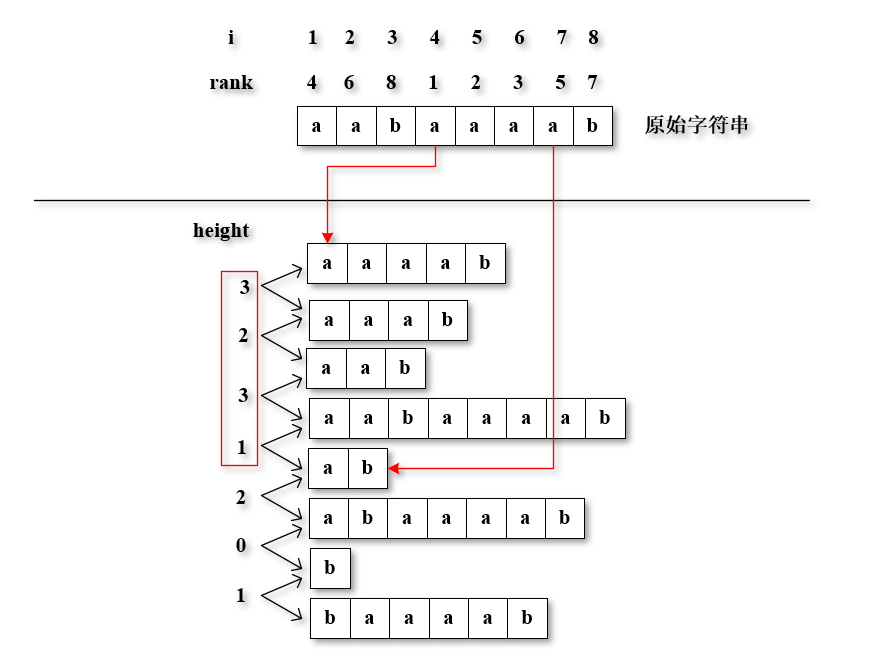

## 后缀数组讲解
> 作者: 张今天
>
> 日期: 2019-8-24
>

----

**注意的问题:**
- 后缀数组和名次数组是什么关系?
- 基数排序是怎么实现的?
- 为何要在原始字符串后面添加一个比原始字符串中所有字符都小的一个特殊字符?
- 什么是第一关键字,什么是第二关键字?
- 怎么利用已知的sa数组得到第二个关键字的顺序?
- 又怎么同时对第一、第二关键字进行排序的?
- 得到第一、第二个关键字的顺序后,又怎么对比是否属于并列的顺序,即是否有相同的顺序?
- 怎么利用已知的后缀数组sa求最长公共前缀字串的?


### 1 基本定义
 
**原始字符串:** S

**后缀:** 从S中的i位置到S的末尾的特殊子串,使用Suffix(i)表示.

**后缀数组:** 后缀数组sa是一个一维的数组,是一个将S的n个后缀从小到大按字典序进行排序后的后缀开头的位置一次放入sa中.

**名次数组:** 名次数组rank也是一个一维数组,主要保存的是sa[i]在所有后缀中的排名.


由上图可知，后缀数组和名次数组的关系为: sa[i] = j,rank[j] = i;

### 2 基本实现

#### 2.1 倍增算法
**2.1.1 注意:**
- 为了方便比较后缀字符串的前k个字符,需要在原始字符串末尾添加一个比字符串中的字符都小的一个数值,
  举个栗子: 两个后缀字符串分别为: `abaaaab`、`ab`,当这两个的前3个字符进行比较时,结果是怎么样?
  当然这用肉眼可以直接肉出来,但在用程序写时该怎么比较呢? 这就是为何要在末尾添加这个比较特殊的字符.

**2.1.2 思想介绍:**

已知一个字符串S,怎么快速求出sa数组呢?首先,介绍一下倍增算法的方法,由名字可以知道这个算法是有倍增的过程的,其基数为2,下面以一个特殊的例子作为介绍,
初始字符串为`aabaaaa`,这个处理过程的思想还是挺容易理解,如下图所示:
 


其中,第一关键字就是指图中x,第二关键字是指图中的y.处理过程如下:
- 第一次是按照每个后缀字符串的第一个字符进行排序,得到第一次的rank,即这一次是k=1时的结果;
- 利用第一、二关键字一起进行排序,就得到了下次的rank数组,当然这也是在第二关键字的基础之上进行的排序,于是可以得到k=2的排序的结果;
- 其实得出第二次排序的结果的过程中,就已经比较了k=3的结果,也就是说,第二次的结果也是k=3时的结果,以下的过程也是如此,所以进行倍增时,
  选择的倍数是2的原因.
- 按照这个过程依次进行,就可以了.

**2.1.3 代码详解:**

[完整代码(Java)](https://github.com/tonemy/Note/blob/master/src/main/java/com/zcs/ComputerBasicSynthesis/DS/DataStructure/SuffixArray/Main.java)

代码的编写过程主要借助基数排序的思想来处理,所以需要你先回顾下基数排序的过程,并从整体的角度来熟练其排序的过程,注意其索引与值的变化.

```
    for(i = 0; i < m; i ++) {
        ws[i] = 0;
    }
    for(i = 0; i < n; i ++) {
        ws[x[i] = r[i]] ++;
    }
    for(i = 1; i < m; i ++) {
        ws[i] += ws[i-1];
    }
    for(i = n - 1; i >= 0; i --) {
        sa[--ws[x[i]]] = i;
    }
```
- 这段代码,就是一个对字符串的每个字符进行的基数排序,其中ws数组代表一个桶,r数组代表字符串中的每个字符,x数组代替了r数组,sa数组的`索引`代表了
  目前所进行的第一次的排序,`值`代表了后缀数组排名的索引位置,这一点不懂得再去看看sa数组和rank的关系.
 
```
    for(p = 0, j = n - k; j < n; j ++) {
        y[p ++] = j;
    }
    for(j = 0; j < n; j ++) {
        if(sa[j] >= k) {
            y[p++] = sa[j] - k;
        } 
    }
```
- `p`变量的初始值为0,也代表了第二关键值的顺序;y数组用来保存此次第二关键值排名顺序的字符位置,即索引位置.
  这段代码主要用来对第二关键值的排序,由上面计算的sa数组可以推出第二关键值的排序,在进行第二关键值排序时,如果有的
  的后缀字符串没有第二关键值,那么它按照字典序进行排序时肯定是要排到前边的,这个就是第一个循环的作用.那么第二循环是
  干什么呢?经过第一次的循环,y数组已经保存了`[0, k-1]`的排名的索引,而剩余的`[k, n-1]`可借助sa数组来计算,从排名
  `0~n-1`依次将(超过k的索引的位置) - k,得出的结果就是第二关键字的剩下的排序顺序.

```
    for(j = 0; j < n; j ++) {
        wv[j] = x[y[j]];
    }
```
- 这个就比较有趣了,它充分发挥了是否对基数排序的能力,为甚麽这样说呢?请仔细看,y现在保存的是第二关键字的索引位置,又因循环的
   限制,所以现在代表第二关键字按排名的顺序的索引位置.而x还是保存的原来数组的字符,现在由于y数组的影响,经过这个循环,wv数组
   保存的就是按第二关键字进行排序后的结果.
```
    for(j = 0; j < m; j ++) {
        ws[j] = 0;
    }
    for(j = 0; j < n; j ++) {
        ws[wv[j]] ++;
    }
    for(j = 1; j < m; j ++) {
        ws[j] += ws[j-1];
    }
    for(j = n-1; j >= 0; j --) {
        sa[--ws[wv[j]]] = y[j];
    }
```
- 这个一看就是基数排序,由于受到y数组的索引位置的影响,先改变他们的顺序,则在进行基数排序时,加入桶的顺序也就发生了改变,
  所以最终的sa数组也受到了y数组的影响.因此,最终得到的sa数组,也就是对第一、二关键字进行了排序的结果
- 以上的两个过程类似使用基数排序对几个两位数进行排序,脑补一下不同之处

```
   for(t = x, x = y, y = t, p = 1, x[sa[0]] = 0, j = 1; j < n; j ++) {
       x[sa[j]] = (y[sa[j-1]] == y[sa[j]] && y[sa[j-1] + k] == y[sa[j] + k]) ? p - 1 : p ++;
   }
```
- 在后缀字符串中的前k个字符进行比较时,难免会遇到相同的,而这段代码,就是比较他们是否相同,如果相同,则排名是相同的,
  注意,这里面的x数组和y数组交换了地址,充分利用了空间,`y[sa[j-1]] == y[sa[j]] && y[sa[j-1] + k] == y[sa[j] + k]`
  这个的意思是,比较相邻排名的字符以及相邻排名的的`sa[j-1] + k`,`sa[j] + k`位置的字符相同,则新的排名就相同,这个可在
  给出图进行脑补.由此,也可以知道,如果`p==n`,那么就可以提前结束了.
- 最后,再将k进行循环,依次倍增

经过以上过程,就可以得出sa数组了,由此也可以推出rank数组.

#### 2.2 DC3算法
#### 2.3 倍增与DC3的比较
### 3 基本应用
#### 3.1 最长公共前缀

**3.1.1简单的介绍**



如图所示,height是我们即将求的数组,它代表了两个相邻`排名`的后缀数组的最长公共前缀的长度,那么说明,求出height数组后.
若想知道某个字符串中字串的最长公共前缀,只需比较height数组中的最大值即可.

**3.1.2详解代码**
```
  for(i = 1; i <= n; i ++) {
    rank[sa[i]] = i;
  }
  for(i = 0; i < n; height[rank[i ++]] = k) {
    for(k = (k == 0) ? 0 : k - 1,j = sa[rank[i] - 1]; r[j + k] == r[i + k]; k ++);
  }
```

- 已知sa数组后,便可以求出rank数组的值,如第一个循环所示.需要注意的是,在求sa数组时,在字符串末尾添加了一个相对于字符串中较小的特殊字符,
  那它的排名肯定是第一,也就是在sa数组中的第一个位置,索引为0,而这里的i就直接是`1 ~ n`,是为了方便计算height.rank保存的是排名,数值k初始
  为0,就是为了计数相邻排名的后缀数组的前缀的长度.第二循环中,由于相邻排名的后缀数组的前缀的长度最多相差`1`,所以每次计算一个k后,再减去1就可以,又为了防止k小于0,使他最小保持0就可以了,
  
#### 3.2 多模式串的模式匹配问题
#### 3.3 最长回文子串问题

### 4 附录
- 参考论文:
- 参考博客:
- 推荐习题: