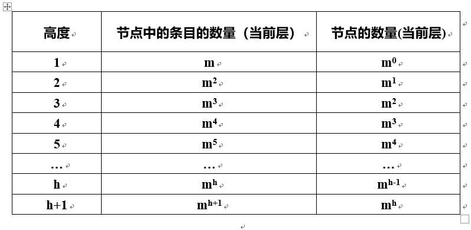
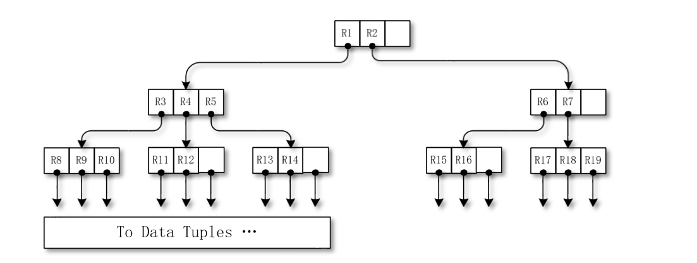

### 1. R-Tree的介绍

**1.1 需要注意的问题:** 
 
1) 每种数据的性质介绍中都有不同的字母代表数据结构的属性，需要注意在R-Tree中的每个字母代表的
    是R-Tree的什么属性?
2) 了解一下`条目`在中文中的意思是什么? 用英文怎么表示的?
3) 注意一下覆盖与重合的区别?
3) `索引条目`与`索引记录条目`存储的是什么？在R-Tree的位置？
4) 已知有N个索引记录,每个节点至少有m个索引条目,通过R-Tree的性质怎么推出R-Tree的最大高度?
    以及节点的数量最多有多少? 此情况下各节点的空间利用率是多少?
5) m <= M/2 ,我对这个式子有一些问题还没解决, m能否为0，M/2取的上界还是下界?(如果有朋友知道
    欢迎分享)
    
**1.2 结构介绍:** 

- 在R-Tree中所有的叶子节点包含了索引记录条目 : (I ,tuple -identifier),I 代表一个n维矩形,
  表示索引的空间对象的边界矩形,I = (I0、I1、I2、...、In-1) [I 后面代表的下标],其中n代表
  维度,In-1代表一个闭区间[a,b],描述了索引的空间对象在n-1这个维度的边界; tuple -identifier
  引用的是一个存放于数据库中的tuple[一条记录]。
- 在R-Tree中的所有非叶子节点包含了索引条目: (I, child-pointer),chid-pointer 指向I覆盖的较小
   空间对象的边界矩形的所有条目,那么I也就是覆盖这些较小的空间对象的边界矩形的较大的空间对象的
   的边界矩形。简单的来说child-pointer 就是指向子节点的指针.
- M代表了R-Tree中一个节点中的最大数量的条目
- m<=(M/2),其中m 表示R-Tree中的一个节点中的最小数量的条目

**1.3 R-Tree性质:**  

- 根节点如果是非叶节点，则其至少有两个子节点.
- 所有叶子节点都在同一层
- 除了根节点的每个叶子节点（I，tuple-identifier）包含了[m,M]个索引记录
- 除了根节点的每个非叶子节点的有[m,M]个孩子节点
 
**1.4 R-Tree属性之间的关系以及对R-Tree的效率影响最大的属性**

- 已知有N个索引记录，求R-Tree的最大高度h？以及所有的节点最大数量?
  由于R-Tree的每个节点中的最小数量的条目为m,所以假设每个节点中都是m,则求出来的就是最大的高度.可以
  结合下面给出的R-Tree的数据结构图,分析此时的情况,如下表所示:
  
  
  
  如上图所示，把第h+1层作为叶子节点的话,第h+1的所有条目即为所有索引记录的条目,即m^(h+1) = N,得出
  的最大高度h为logm(N) - 1.
  如上图的第三列即为每层的节点的数量，已知m^(h+1) = N,则可以分别求出m^h= N/m,m^(h-1)= N/(m^2)...,
  1,然后把其相加就可以了。此时的每个节点的空间利用率即为m/M。
  
  
  
  

### 2. R-Tree的搜索

### 3. R-Tree的插入

### 4. R-Tree的删除

### 5. R-Tree的修改