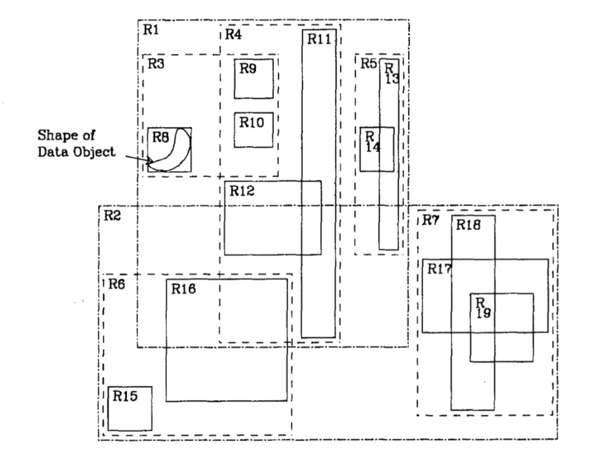

## 目录:

- [1. R-Tree的介绍](#1. R-Tree的介绍)

- [2. R-Tree的搜索](#2. R-Tree的搜索)

- [3. R-Tree的插入](#3. R-Tree的插入)

- [4. R-Tree的删除](#4. R-Tree的删除)

### 1. R-Tree的介绍

**1.1 需要注意的问题:** 
 
1) 每种数据的性质介绍中都有不同的字母代表数据结构的属性，需要注意在R-Tree中的每个字母代表的
    是R-Tree的什么属性?
2) 了解一下`条目`在中文中的意思是什么? 用英文怎么表示的?
3) 注意一下覆盖与重合的区别?
3) `索引条目`与`索引记录条目`存储的是什么？在R-Tree的位置？
4) 已知有N个索引记录,每个节点至少有m个索引条目,通过R-Tree的性质怎么推出R-Tree的最大高度?
    以及节点的数量最多有多少? 此情况下各节点的空间利用率是多少?
5) m <= M/2 ,我对这个式子有一些问题还没解决, m能否为0，M/2取的上界还是下界?(如果有朋友知道
    欢迎分享)
    
**1.2 结构介绍:** 

- 在R-Tree中所有的叶子节点包含了索引记录条目 : (I ,tuple -identifier),I 代表一个n维矩形,
  表示索引的空间对象的边界矩形,   ,其中n代表
  维度, 代表一个闭区间[a,b],描述了索引的空间对象在第i个维度的边界; 
  tuple -identifier引用的是一个存放于数据库中的tuple[一条记录]。
- 在R-Tree中的所有非叶子节点包含了索引条目: (I, child-pointer),chid-pointer 指向I覆盖的较小
   空间对象的边界矩形的所有条目,那么I也就是覆盖这些较小的空间对象的边界矩形的较大的空间对象的
   的边界矩形。简单的来说child-pointer 就是指向子节点的指针.
- M代表了R-Tree中一个节点中的最大数量的条目
- m<=(M/2),其中m 表示R-Tree中的一个节点中的最小数量的条目

**1.3 R-Tree性质:**  

- 根节点如果是非叶节点，则其至少有两个子节点.
- 所有叶子节点都在同一层
- 除了根节点的每个叶子节点（I，tuple-identifier）包含了[m,M]个索引记录
- 除了根节点的每个非叶子节点的有[m,M]个孩子节点
 
**1.4 R-Tree属性之间的关系以及对R-Tree的效率影响最大的属性**

- 已知有N个索引记录，求R-Tree的最大高度h？以及所有的节点最大数量?
  由于R-Tree的每个节点中的最小数量的条目为m,所以假设每个节点中都是m,则求出来的就是最大的高度.可以
  结合下面给出的R-Tree的数据结构图,分析此时的情况,如下表所示:
  
  
  
  如上图所示，把第h+1层作为叶子节点的话,第h+1的所有条目即为所有索引记录的条目,即,得出
  的最大高度h为 .
  如上图的第三列即为每层的节点的数量，已知,则可以分别求出每层的节点的数量
  ,然后把它们相加就可以了。此时的每个节点的空间利用率即为m/M。
  
  
  
  

### 2. R-Tree的搜索
**2.1 需要注意的问题:** 
1) 注意下面字母表示的什么？
2) 注意对比R-Tree的搜索过程与B-Tree的搜索过程的不同之处?
3) 注意使用递归思想来写搜索时,其根节点是不断变化的，所以注意一下下面的我所表达的?

**2.2  字母标识:** 

1) E : 一个索引条目(Index Entry)
2) E.I : 索引条目E记录的空间索引对象的边界矩形
3) E.p : 指向索引条目（孩子节点）或者索引记录条目(tuple —identifie)的指针
4) T : R-Tree 的根节点
5) S : 搜索的区域

**2.3  R-Tree的Search算法:**

- 输入 : 一个S
- 输出 : 所有与S相交的索引记录条目

1) 【搜索子树】: 如果T不是一个叶节点，则检查其中的每一个索引条目E，如果E.I与S相交，
   则对E.p所指向的那个孩子节点的根节点调用Search算法.
2) 【搜索叶子节点】: 如果T是一个叶子节点,检查所有的条目,如果E.I与S相交，则E就是一个
    搜索的索引记录.

**2.4 关键代码(java):**
```
    // 叶子节点的搜索
    private Entry<T, S> searchLeaf(NodePosition<T, S> np) {
        int i = np.position();
        Leaf leaf = (Leaf)np.node();
        do {
            Entry entry = leaf.entry(i);
            if(this.condition.test(entry.geometry())) {
                np.setPosition(i + 1);
                return entry;
            }
            ++i;
        } while(i < leaf.count());
        np.setPosition(i);
        return null;
    }
    //非叶子的搜索,这里使用了一个栈来模拟了递归的过程
    private void searchNonLeaf(NodePosition<T, S> np) {
        Node child = ((NonLeaf)np.node()).child(np.position());
        if(this.condition.test(child.geometry())) {
            this.stack.push(new NodePosition(child, 0));
        } else {
            np.setPosition(np.position() + 1);
        }
    }
```

### 3. R-Tree的插入

**3.1 需要注意的问题:** 

- 这里没有特定的输入形式，可以使用构造函数根据传入的参数而改变.
- `ChooseLeaf`算法,可以根据具体情况选择不同的方式进行选择,比如: 可以按最小覆盖面积或
  最小的区域增长的方式或者两者结合的方式.当然需要和分裂算法对应。

**3.2 R-Tree的Insert算法:**

- 输入: 一个条目E
- 输出: 插入后的R-Tree的根节点

1) 【找到E的位置】: 调用`ChooseLeaf`算法选择合适的叶子节点L.
2) 【在叶子节点添加E】: 如果L有空间添加一个E,直接添加E就可以了.如果没有额外的空间,需要调用`SplitNode`
    节点L将变成两个新节点L和LL,L和LL中分别保存了E和旧L中的所有条目.
3) 【向上传播树的变化】: 如果步骤2中没经历节点分裂,对节点L调用`AdjustTree`算法,否则还要对LL节点调用
    `AdjustTree`算法.
4) 【R-Tree的高度增加】: 在向上传播树的变化时, 如果导致根节点root也分裂了,那么需要一个新的root,指向分裂的两个
    孩子节点

**3.3 R-Tree的ChooseLeaf算法:**

- 输入: 一个条目E
- 输出： T(这个T指的是最终在R-Tree的叶子节点的位置)

1) 【初始化】: 设N为R-Tree的根节点
2) 【检查是否是叶子节点】: 如果N是叶子节点，则返回N
3) 【选择子树】: 如果N 不是叶子节点，使F为N中的条目，选择F.I 是N中所有条目中包含E.I ,且最小的.
4) 【向下遍历直到叶子节点】: 设N为F.p的孩子节点，返回3.

**3.4 R-Tree的AdjustTree算法:**

1) 【初始化】 : 将L记为N,如果L已经被分裂成为了L和LL，则将LL记为NN。
2) 【检查是否结束】; 如果N是根节点，算法结束
3) 【调整在父节点中的覆盖矩形】 : 使P为N的父节点，为P的条目, 调整使之能够包围N中的所有条目的边界矩形
4) 【向上传播分裂的节点】 : 如果N有个(因早期分裂导致的同伴)NN，创建一个新条目, 指向NN，并且包围NN中的所有边界矩形
     如果P有空间, 则把添加到P.否则调用SplitNode算法将P分为包含旧P的所有的条目和包含的PP节点.
5) 【移动到上一层】果P发生了分裂，则令N=P，令NN=PP，然后返回步骤2重新开始运算

**3.5 R-Tree的SplitNode算法:**

如果在已经包含M个条目的节点中添加一个新的条目，就需要将M+1个节点分别划分到两个节点中。由于进行搜索操作的时候，一个节点是否被访问取决于它的外廓矩形是否与查询范围相交，所以节点划分的原则是两个新节点的外廓矩形的总面积应当尽可能少。
下面有三个时间复杂度不同的算分裂算法
- 穷举算法：

列举出所有可能的分组方案，从中选择最佳的方案,时间复杂度为

- O(N^2)的(QuadraticSplit)算法

这种算法首先从M+1个条目中选出两个条目作为两个新组的第一个元素。这两个条目的选择原则为：两个条目如果放在同一组中，
会有最多的冗余空间。也就是说，两个条目的总的外廓矩形面积，减去两个条目所占用的面积，其差最大。接下来剩余的条目将按
一定的顺序分入两个组当中。顺序是这样计算的：每个条目插入A组或B组导致的面积增长程度会有所不同。插入两个组后，两个组
面积增长程度差异最大的那个条目、就是接下来要插入的条目

1) 【分别为两个组选择第一个条目】: 使用`PickSeed算法`为两个组选择第一个元素，分别把选中的两个条目分配到两个组中。
2) 【检查是否结束】:如果所有条目都已经分配完毕，算法结束。如果一个组中的现有的条目太少，以至于生于的未分配的所有的
    的条目都要分配到这个组中，才能避免下一，则将剩余的所有条目都分配到这个组中，算法结束
3) 【选择一个条目进行分配】:调用`PickNext算法`来选择下一个进行分配的条目.将其加入一个组，要求它加入这个组比加入另一个组
    能有较小的面积增长。如果两个面积增长相同，则将其加入面积较小的那个组当中。若两个组面积也相同，则加入条目数更少的那个组当中。然后返回步骤2继续进行。
4) `PickSeed算法`：
    - 【计算即将加入这个组的条目的效率】: 对于每一个条目E1、E2和同时包含E1、E2的边界矩形J,
    计算d=Area(J) - Area(R1.I) - Area(R2.I)
    - 【选择浪费空间最大的一组】: 选择d值最大的一组E1和E2。
5) `PickNext算法`：
    - 【对于每一个没有分配到组中的剩余条目E】: 计算将E.I 放到 group1 中后的面积增加值 d1 ,同理计算d2.
        计算d1、d2差值的绝对值：d = |d1 - d2|
    - 【选择分配的合适的组】： 选择d最大的条目

- O(N)的(LinearPickSeeds)算法:

1) 【找到所有维度的极端边界矩形】: 沿着每个维度，找到空间索引对象的边界矩形低边界的最高的条目，以及具有高边界最低的条目。记录两者的距离.
2) 【调整空间边界矩形的形状】: 进行标准化,将上述步骤1计算的每个维度的距离除以在对应的每个维度的边界的最大投影长度.记为标准化的距离
3) 【选择最极端的一组】: 选择标准化距离最大的一组.

### 4. R-Tree的删除

**4.1 R-Tree的Delete算法:**
- 输入: E
- 输出: 删除E的R-Tree的root

1) 【找到节点包含的记录】: 调用`FindLeaf`算法找到包含E的叶子节点E，如果没找到，结束算法.
2) 【删除记录】: 把E从L中删除
3) 【向上传播】: 调用`CondenseTree算法`进行调整
4) 【缩短树】:如果树在经过调整后，根节点只剩下了一个子节点，那么就把这个子节点当成根节点

**4.2 R-Tree的FindLeaf算法:**

1) 【搜索子树】: 如果T非叶子节点,检查T中的条目F的,对于每个
    与重合（相交）的调用`FindLeaf算法`,传入的参为
    直到被E找到或所有条目被检查
2) 【搜索叶子节点】: 如果T为叶子节点，检查每个在T中的条目,如果和E匹配，返回T

**4.3 R-Tree的CondenseTree算法:**

评估这个节点的条目数是否太少，如果太少，应将这些条目移到其他节点中。如果有必要，要逐级向上进行这种评估。调整向上传递的路径上的所有外廓矩形，使其变小。
1) 【初始化】： 设N为L,初始化一个为空集合Q
2) 【找到父节点的条目】: 如果N是root,直接到步骤6.否则,使P为N的父节点,是P中的条目
3) 【消除下溢的节点】: 如果N中的条目少于m个,删除，删除在P中的，将N添加到集合Q
4) 【调整覆盖的矩形】 : 如果N美国有被删除,调整,使其能够包为N中的所有条目
5) 【移动至树的上一层】 : 设N=P ，重复步骤2
6) 【重新插入孤立的条目】 :  在集合Q中的节点的所有条目重新调用Insert算法进行插入.但是来自更高级别节点的条目必须放在树中更高的位置，这样它们的从属子树的叶子将与主树的叶子处于同一级别


### 5. R-Tree的修改

**R-Tree的Update算法**

1) 利用上方的算法，相应的索引记录被删除、更新、然后重新插入操作


